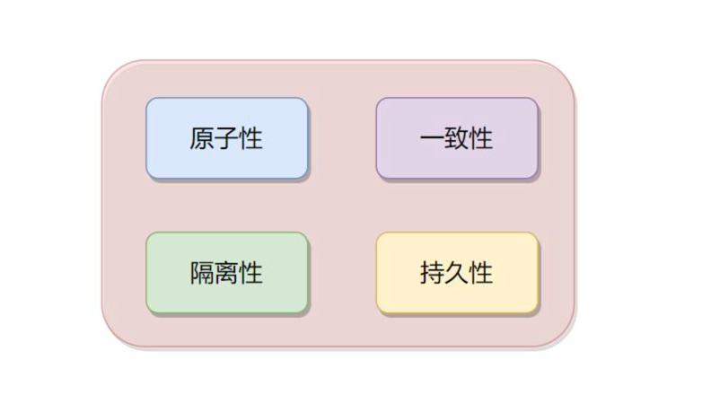
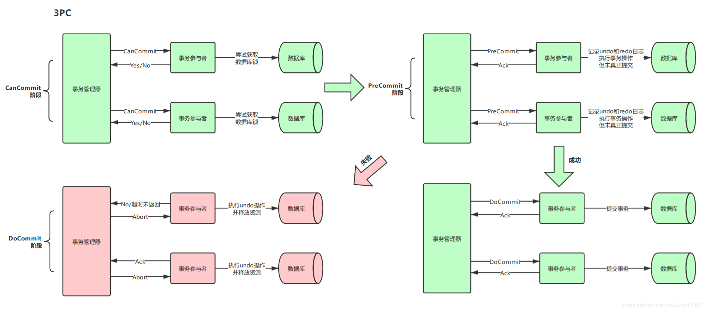

# 事务处理 (一)

事务处理是构建分布式系统过程中不可忽略的部分，在谈分布式事务之前，先对**事务**的重要理论知识进行回顾。

阅读下文前，务必已熟悉何为**ACID特性**，数据库基本概念等，这里不做赘述。


### 本地事务

本地事务是指仅操作单一事务资源的、不需要全局事务管理器进行协调的事务。


#### 如果实现原子性和持久性

1. Commit Logging
   
    提交日志的方式，即以仅进行顺序追加的文件写入的形式先记录到磁盘中。

2. Shadow Paging

#### 实现隔离性

现代数据库提供了三种锁：
1. 写锁，即排它锁。只有持有写锁的事务才可以对数据进行写操作。这是其他事务不能写入数据，也不能施加读锁。
2. 读锁，即共享锁。多个事务可以对同一个数据施加读锁，数据被加上读锁后就无法再施加写锁。对于持有读锁的事务，如果当前只有它一个事务有读锁，可允许直接将其升级为写锁。
3. 范围锁。对于某一个范围直接加排它锁，这个范围内的数据不能直接被写入。

##### 隔离级别
隔离程度越高，并发访问时的吞吐量就会越低

- 可串行化

- 可重复读
    
    这是MySQL/InnoDB的默认隔离级别，可重复读对事务涉及的数据施加读锁和写锁且一直到事务结束，但不加范围锁。相较于可串行话，存在**幻读**问题，在事务的执行过程中，查询相同范围的数据获取到不同的结果
```sql
select count(1) from t_a where column_b < 10 #事务1
insert into t_a(column_b) values ('ccc') #事务2
select count(1) from t_a where column_b < 10 #事务1
```
- 读已提交
    
    对事务涉及的写锁会一直持续要事务结束，但加的读锁在执行完会马上释放。相较于可重复读弱化的地方在于不可重复读问题，对同一行数据相同的查询得到了不同的结果。因为这个过程缺乏了读锁，不能禁止读取过的数据发生变化
```sql
select * from t_a where id =  10 #事务1
update t_a set d = 111 where id = 10 #事务2
select * from t_a where id =  10 #事务1
```

- 读未提交
    
    对事务涉及的数据加写锁，读锁完全不加。会出现脏读问题，指在事务执行过程中，一个事务读取到了另一个事务未提交的数据。这里需要注意写锁的定义，写锁禁止其他事务施加读锁，但是不代表不允许其他事务读取事务。
```sql
select * from t_a where id =  10 #事务1
update t_a set d = 111 where id = 10 #事务2
select * from t_a where id =  10 #事务1
rollback; #事务2
```
### 全局事务
这里引用周志明的《凤凰架构》中相关介绍

1. 2PC（两段式提交）
```
假如你平时以声明式事务来编码，那它与本地事务看起来可能没什么区别，都是标个@Transactional注解而已，但如果以编程式事务来实现的话，就能在写法上看出差异，伪代码如下所示：
public void buyBook(PaymentBill bill) {
    userTransaction.begin();
    warehouseTransaction.begin();
    businessTransaction.begin();
	try {
        userAccountService.pay(bill.getMoney());
        warehouseService.deliver(bill.getItems());
        businessAccountService.receipt(bill.getMoney());
        userTransaction.commit();
        warehouseTransaction.commit();
        businessTransaction.commit();
	} catch(Exception e) {
        userTransaction.rollback();
        warehouseTransaction.rollback();
        businessTransaction.rollback();
	}
}
从代码上可看出，程序的目的是要做三次事务提交，但实际上代码并不能这样写，试想一下，如果在
businessTransaction.commit()中出现错误，代码转到catch块中执行，此时userTransaction和
warehouseTransaction已经完成提交，再去调用rollback()方法已经无济于事，这将导致一部分数据被提
交，另一部分被回滚，整个事务的一致性也就无法保证了。
```

为了解决这个问题，XA 将事务提交拆分成为两阶段过程：

- 准备阶段：又作投票阶段，协调者询问事务的所有参与者是否准备好提交，参与者如果准备好提交则回复Prepared。对于数据库来说，准备操作是在重做日志中记录全部事务提交操作所要做的内容，不释放隔离性，继续持有锁。
- 提交阶段：又作执行阶段，协调者在上一阶段收到Prepared消息，先自己在本地持久化事务状态为Commit，操作完成之后向所有参与者发送Commit指令；否则，任意一个参与者回复了 Non-Prepared 消息，或任意一个参与者超时未回复，协调者将将自己的事务状态持久化为 Abort 之后，向所有参与者发送 Abort 指令，参与者立即执行回滚操作。

缺点
- 单点问题：协调者在两段提交中具有举足轻重的作用，协调者等待参与者回复时可以有超时机制，允许参与者宕机，但参与者等待协调者指令时无法做超时处理。一旦宕机的不是其中某个参与者，而是协调者的话，所有参与者都会受到影响。如果协调者一直没有恢复，没有正常发送 Commit 或者 Rollback 的指令，那所有参与者都必须一直等待。

- 性能问题：两段提交过程中，所有参与者相当于被绑定成为一个统一调度的整体，期间要经过两次远程服务调用，三次数据持久化（准备阶段写重做日志，协调者做状态持久化，提交阶段在日志写入 Commit Record），整个过程将持续到参与者集群中最慢的那一个处理操作结束为止，这决定了两段式提交的性能通常都较差。

- 一致性风险：当网络稳定性和宕机恢复能力的架设不成立时，仍可能出现一致性问题。

2. 3PC（三段式提交）
   
三段式提交把原本的两段式提交的准备阶段细分为两个阶段，分别称为CanCommit、PreCommit，提交阶段改为 DoCommit阶段。CanCommit是询问阶段，协调者让每个参与者根据自身状态评估事务是否可能完成。

将准备阶段一分为二的理由是：协调者发出开始准备的消息，参与者开始写重做日志，如果此时，某一个参与者宣布无法完成，相当于大家做了一轮无用功。

因此，在事务需要回滚的场景中，三段式的性能通常是要比两段式好很多的，但在事务能够正常提交的场景中，两者的性能都依然很差，甚至三段式因为多了一次询问，还要稍微更差一些。

同样也是由于事务失败回滚概率变小的原因，在三段式提交中，如果在 PreCommit 阶段之后发生了协调者宕机，即参与者没有能等到 DoCommit 的消息的话，默认的操作策略将是提交事务而不是回滚事务或者持续等待，这就相当于避免了协调者单点问题的风险。



3. 这里我在网上评论区看到一个生动的例子，很方便理解，贴出网友@zhanyd
```text
学校组织知识竞赛，学生们（参与者）以一组为单位参加比赛，由一个监考老师（协调者）负责监考。

考试分为考卷和答题卡，学生必须先在十分钟内把答案写在考卷上（记录日志），然后在三分钟内把答案涂到答题卡上（提交事务）。

两段式提交

准备阶段：老师宣布：“开始填写考卷，时间十分钟”。

十分钟内，写好考卷的学生就回答：Prepared,十分钟一到，动作慢，还没写好学生，就回答：Non-Prepared。

如果有学生回答Non-Prepared，该小组被淘汰。


提交阶段：如果所有的学生都回答了Prepared，老师就会在笔记本上记下，“开始填答题卡”（Commit），然后对所有的学生说：“开始填答题卡”（发送 Commit 指令）。

学生听到指令后，就开始根据考卷去涂答题卡。

如果学生在涂答题卡的时候，过于紧张把答题卡涂错了，还可以根据考卷重新涂。

如果所有的学生在规定时间内都填好了答题卡，老师宣布该小组考试通过。


三段式提交

CanCommit阶段：老师先给学生看一下考卷，问问学生能不能在十分钟内做完。如果有学生说没信心做完，该小组直接淘汰。

PreCommit阶段：如果学生都说能做完，老师就宣布：“开始填写考卷，时间十分钟”，和两段式提交的准备阶段一样。

DoCommit阶段：和两段式提交的提交阶段一样。
```

谈到这里，不管是2PC还是3PC性能还是都比较差的，像2PC本身是会出现堵塞问题，不太适用于如今微服务架构中的分布式事务问题。

